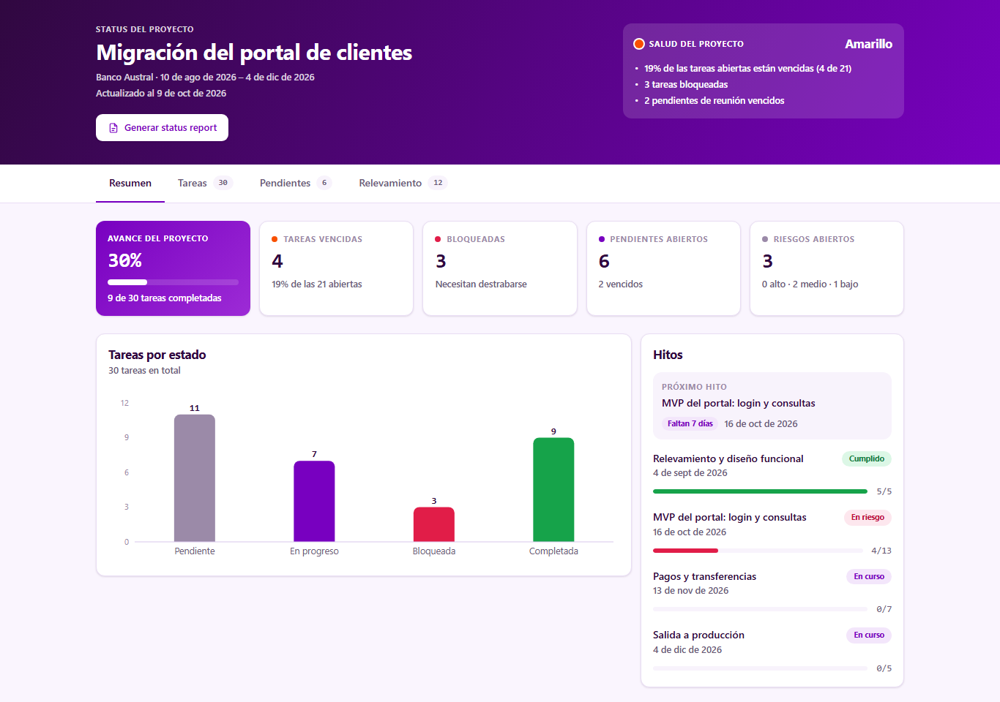
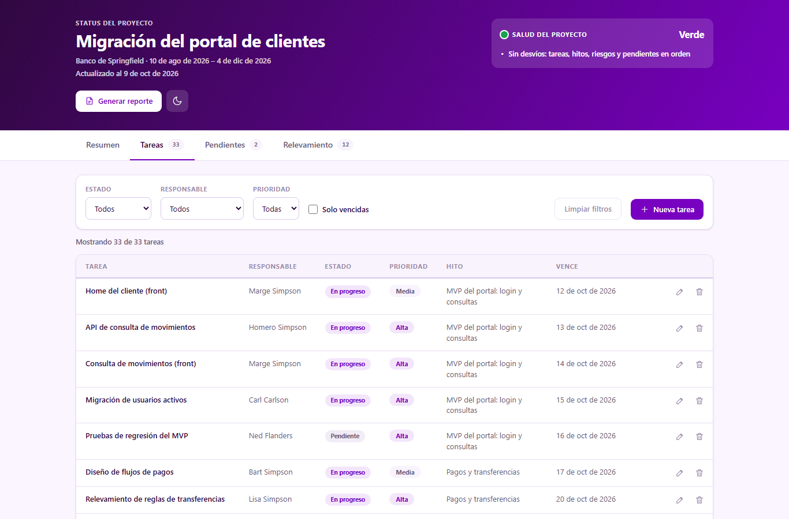
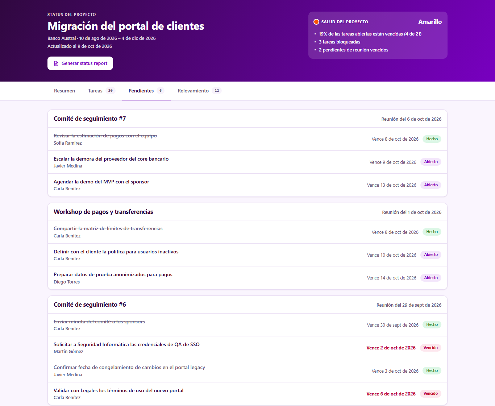
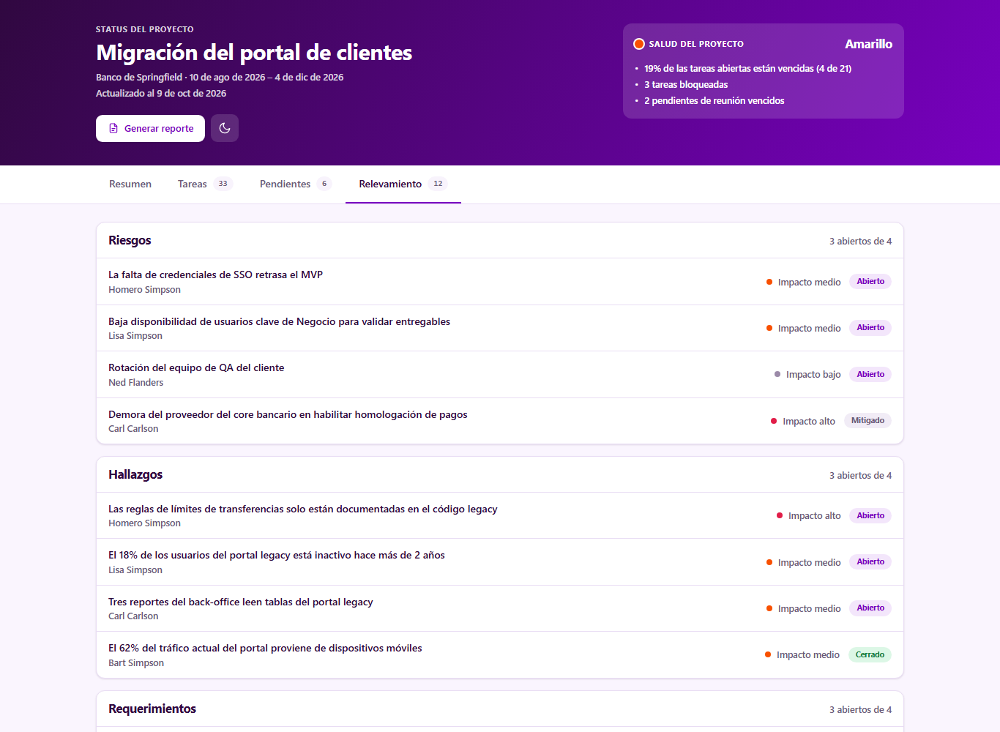
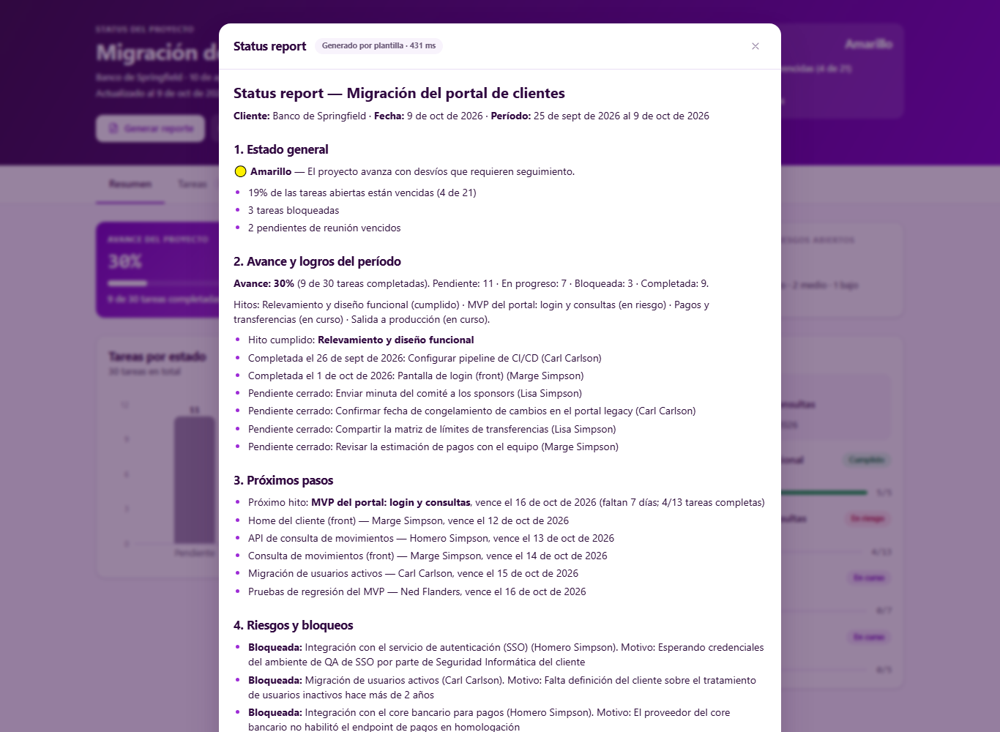
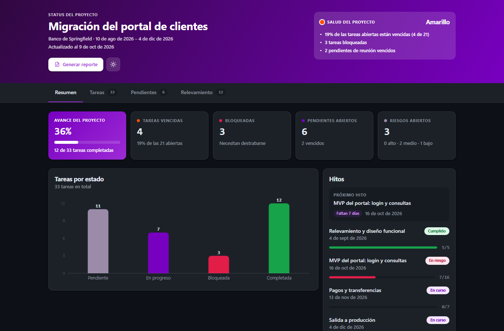

# Status Board

Tablero que centraliza el estado de un proyecto (tareas, pendientes de reunión e ítems relevados) y genera el **status report ejecutivo con un clic**, para reemplazar el reporte que hoy se arma a mano.

> Todos los datos son ficticios.

**Demo:** https://task-board-seven-alpha.vercel.app



## El problema

El status report semanal se arma a mano: alguien junta el estado de las tareas de una planilla, los pendientes de las minutas de reunión y los riesgos de un documento de relevamiento, y redacta un resumen para los sponsors. Lleva tiempo, depende de quién lo arme y suele llegar desactualizado.

## La propuesta

El PM abre el tablero y en un vistazo ve la salud del proyecto:

- **Semáforo de salud** (verde / amarillo / rojo) **con los motivos**, calculado con reglas explícitas.
- **KPIs:** % de avance, tareas vencidas, bloqueadas, pendientes abiertos y riesgos abiertos.
- **Gráfico** de tareas por estado e **hitos** con su avance, el próximo hito y los días que faltan.
- **Tareas** con filtros por estado, responsable y prioridad. Las vencidas se marcan en rojo y las bloqueadas muestran su motivo.
- **ABM de tareas:** crear, editar y eliminar tareas desde el tablero. Los KPIs y el semáforo se actualizan al instante. Los cambios se guardan en el navegador y se pueden descartar con "Restablecer datos de demo".
- **Pendientes** de reunión agrupados por reunión, y **relevamiento** (riesgos, hallazgos y requerimientos) con su impacto y estado.
- **"Generar reporte":** arma el reporte ejecutivo con 5 secciones (estado general, avance y logros, próximos pasos, riesgos y bloqueos, decisiones requeridas), listo para copiar, descargar en Markdown o imprimir / guardar como PDF.

| Tareas | Pendientes | Relevamiento |
|---|---|---|
|  |  |  |



**Tema claro y oscuro** (sigue la preferencia del sistema y se puede cambiar con el botón del encabezado) y **diseño responsive**: en celular, las tareas se muestran como tarjetas.



## Cómo correrlo

Requisitos: Node.js 20 o superior.

```bash
npm install
npm run dev      # http://localhost:3000
```

No hace falta configurar nada: sin API key, el reporte se genera con una plantilla.

Otros comandos:

```bash
npm run build    # build de producción
npm run start    # sirve el build
npm run lint
npm test         # tests unitarios (Vitest)
```

### Activar el reporte con IA (opcional)

Creá un archivo `.env.local` en la raíz (no se commitea; hay un ejemplo en `.env.example`):

```
ANTHROPIC_API_KEY=sk-ant-...
ANTHROPIC_MODEL=claude-sonnet-5-5
```

La key se obtiene en la [Claude Console](https://platform.claude.com) (Settings → API Keys). Conviene usar una key exclusiva para este proyecto y fijar un límite de gasto mensual en la Console. Con la key configurada, el mismo botón genera el reporte con Claude y el panel muestra "Generado con IA". Si la key falta, es inválida o la IA no responde en 15 segundos, la app usa la plantilla automáticamente. Para cuidar el gasto, los reportes con IA tienen un límite de uso (6 cada 10 minutos por IP y 60 por hora en total); al superarlo, el reporte sale igual, con la plantilla.

## Uso de IA

**Para construirlo.** Todo el proyecto se desarrolló con [Claude Code](https://claude.com/claude-code) a partir de un `CLAUDE.md` que define el alcance, el stack, el modelo de datos, las reglas del semáforo y un plan de 8 pasos. Claude implementó cada paso y lo verificó (`npm run build`, lint, llamadas al endpoint y capturas con un navegador headless) antes de commitear. Las decisiones de producto quedaron del lado humano: alcance, estética, dependencias nuevas y qué publicar.

**Dentro del producto.** El status report puede generarlo Claude, vía la API de Anthropic:

- Las métricas se calculan en el servidor, y al modelo se le envía un **resumen estructurado**, no el JSON crudo. Así se evita que el modelo calcule mal o invente cifras.
- El prompt fija las 5 secciones, el largo (una página) y la regla de **no inventar datos** que no estén en el input.
- La IA es **opcional**: ante cualquier falla, la app responde con el reporte por plantilla, que parte del mismo resumen. La respuesta indica la fuente (`"ai"` o `"template"`) y la interfaz la muestra.

## Cómo está hecho

- **Next.js 15** (App Router) + **TypeScript** + **Tailwind CSS 4**
- **Vitest** para los tests unitarios
- **Recharts** para el gráfico; **react-markdown** + **remark-gfm** para mostrar el reporte
- **@anthropic-ai/sdk** para la generación con IA (solo del lado del servidor; la key nunca llega al navegador)
- Sin base de datos: los datos de prueba están en [`src/data/proyecto-demo.json`](src/data/proyecto-demo.json). Las fechas se corren respecto del día actual, así que siempre hay tareas vencidas y próximas. Las tareas editadas se guardan en el `localStorage` del navegador.
- Estética basada en el design system de Flock (paleta, tipografía y componentes)

```
src/
  app/page.tsx              # tablero con pestañas (?tab=resumen|tareas|pendientes|relevamiento)
  app/api/report/route.ts   # POST: status report (IA o plantilla)
  components/               # Dashboard (estado del cliente), KPIs, semáforo, gráfico, hitos, tabla,
                            # formulario de tarea, modal, listas y panel del reporte
  lib/tasks.ts              # validación de tareas (formulario y endpoint)
  lib/use-tasks.ts          # ABM de tareas guardado en el navegador
  lib/metrics.ts            # KPIs y semáforo (funciones puras)
  lib/report-summary.ts     # resumen estructurado que usan la plantilla y el prompt
  lib/report-template.ts    # reporte sin IA
  lib/report-prompt.ts      # prompt para el LLM
```

La especificación funcional (modelo de datos, KPIs, reglas del semáforo y contrato del endpoint) está en [`docs/SPEC.md`](docs/SPEC.md).

## Próximos pasos

- **Integraciones reales** con Jira, Trello o Azure DevOps para las tareas, y con las minutas de reunión para los pendientes.
- **Persistencia compartida** (base de datos) para que los cambios de tareas se vean en todos los navegadores, y **ABM de pendientes, ítems relevados e hitos**.
- **Login y usuarios**, con vistas por rol (PM, sponsor, equipo) y **multi-proyecto / multi-cliente**.
- **Historial de reportes** y envío programado por mail o Teams.
- **Notificaciones** ante cambios de semáforo o vencimientos.
- **Tests de interfaz y de punta a punta** (por ejemplo con Playwright); hoy los tests unitarios cubren la lógica y el endpoint.
